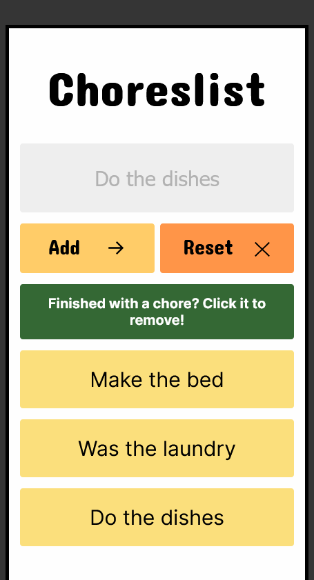
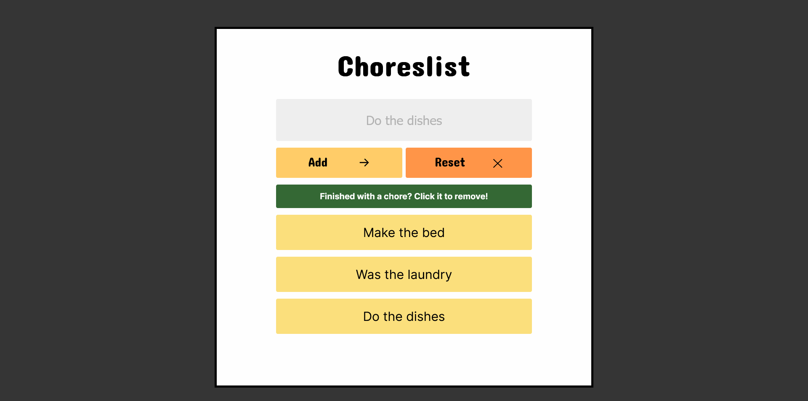

 ## Table of contents

- [Overview](#overview)
  - [The challenge](#the-challenge)
  - [Screenshot](#screenshot)
  - [Links](#links)
- [My process](#my-process)
  - [Built with](#built-with)
  - [What I learned](#what-i-learned)
  - [Continued development](#continued-development)
  - [Useful resources](#useful-resources)
- [Author](#author)
- [Acknowledgments](#acknowledgments)


### Overview

Scrimba M3 bootcamp project
[Scrim](https://scrimba.com/scrim/co3004026ac4f5b88ce3a014f)

### The challenge

Requirements:
- built it from "scratch"
- follow the design spec
[Figma file](https://www.figma.com/file/C99iu5lAQ2RAELrXrjrULv/Choreslist-(Copy)?node-id=0%3A1&t=2tDh96MyqAzYAwVp-0)
- can't add empty chore  Idea: "required in input tag"
- make sure you use
   - addEventListener()
   - X symbol double-click removes all chores
   - innerHTML
   - Template strings
   - localStorage - make sure they are remembered by the browser

Stretch goals
- can't add existing chore
- click on individual chores to remove from list
- show a random GIF when all chores are completed

Personal stretch goals
- responsive design
- better UI/UX / accessibility

Ideas
- conditionals
- render <li> items in JS
- show GIF - Pumpkin's meme picker


 ### Screenshot

 
 

### Links

[Scrim](https://scrimba.com/scrim/co66f4672bc42a373fbd1968f)
[Github](https://github.com/casserole27/choreslist)
[Live Site](https://www.clewisdev.com/choreslist/)

## My process

- Create Github repository
- Set up basic HTML file 
- Set up basic CSS file
- Set up basic JavaScript file
- Consult Figma design files
- Project work
- Publish live URL
- Check markup and accessibility
(https://validator.w3.org/)
(https://wave.webaim.org/)
- README file

### Built with

- semantic HTML5
- mobile first design
- CSS custom properties
- Responsive Web Design
- vanilla JavaScript
- chatGPT pair programming

### What I learned

I did some pair programming with chatGPT to figure out some of the logic of this program.
Many times I was headed in the right direction, but did not have the exact right syntax or logic to get there.
In this instance, the more specific my questions were to the chat, the better my results were.

```javascript
function renderChores() {
    
    ulEl.innerHTML = "";
    
    for (let i = 0; i < myChores.length; i++) {
        
        const chore = document.createElement("li");
        chore.textContent = myChores[i];
        ulEl.appendChild(chore);

        chore.addEventListener("click", function() {
            let content = this.textContent;
            this.style.visibility = "hidden";
            removeChores(myChores, content);
        
          if (myChores.length === 0) {
            showModal()
          };
          
        });
     };
};
```

- .createElement() and .appendChild() instead of rendering HTML with template literals
- per chatGPT, I learned this is a way to select the list item's text content as a value
- [MDN Event Target](https://developer.mozilla.org/en-US/docs/Web/API/Event/target)
   
```javascript
function removeChores(arr, value) {
    const index = arr.indexOf(value);
    if (index !== -1) {
        arr.splice(index, 1)
        localStorage.clear()
        localStorage.setItem("myChores", JSON.stringify(myChores))
    }
};
```
- how to remove a specific item from an array
per chatGPT, myChores and content, the text content of the list items, are the parameters of this function.
A variable with the value arr.indexOf(value) was a better way of finding where the text content of the list items exists in the array, 
and the using the .splice() method to remove it.
- it was necessary to redo localStorage at this point as well, or the list items would stay there.

### Continued development

Accessibility 
- I did some rearranging and refactoring of this UI to improve the UX and accessibility.
- Added text to the buttons, and moved them below the input field
- Added hover, focus, and active pseudo-classes
[Accessibility issues with icon fonts](https://www.youtube.com/watch?v=9xXBYcWgCHA)

It is still not readily apparent that the list items should be clicked on to remove them.
 - radio or checkbox inputs may be a better option

 Code reviewer tips and suggestions:
 [Scrim](https://scrimba.com/scrim/co1964f5caef6b7599accd121)

 ```javascript
 function getChores() {
   
    if (!myChores.includes(choresInput.value)) {
        
        //! This is where the if statement should go prohibit blank rendering
        if (choresInput.value != "") {  
        myChores.push(choresInput.value);
        };
    };
```    
-"When it come to JavaScript, it's crucial to validate user input before accepting it."
-add an HTML heading to instruct a user to click the list to remove
     - this works, but it isn't the most elegant solution
     - I still think checkboxes or radio inputs would be better, but sticking with project requirements for now


### Useful resources

[Scrimba help](https://scrimba.com/scrim/co3004026ac4f5b88ce3a014f)


## Author

- Website - [C Lewis](https://www.clewisdev.com)
- LinkedIn - [LinkedIn](https://www.linkedin.com/in/clewisdev/)


## Acknowledgments


